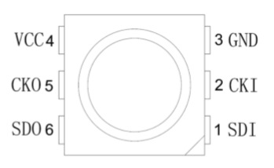
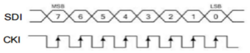
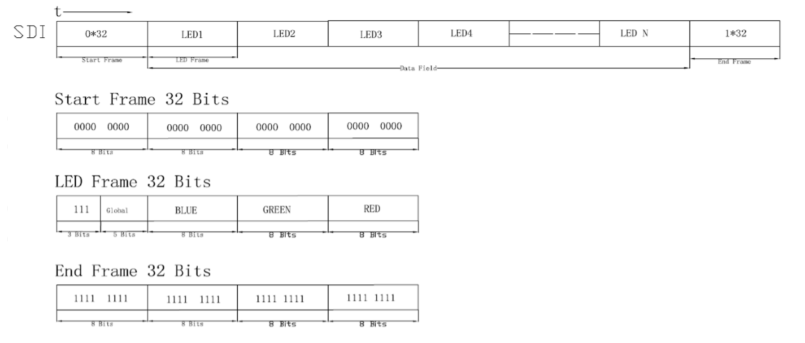

在 dotnet/iot 中使用 SPI 驱动 SK9822
==============================

SK9822（兼容 APA102）是一款内置控制器的全彩 RGB LED 灯珠。通常使用标准的 5050 RGB 封装。与 WS2812B 相比其优势在于 SK9822 自带时钟线，不需要像 WS2812B 那样严格控制每一个电平的时间，更适合如树莓派这样不能精确控制时序的设备。

引脚定义
--------


 
|针脚|标号|名称|说明|
|----|----|----|----|
|1|SDI|数据输入|串行控制信号输入|
|2|CKI|时钟输入|串行时钟信号输入|
|3|GND|接地|信号、电源共地|
|4|VCC|电源|电源输入|
|5|CKO|时钟输出|串行控制时钟输出|
|6|SDO|数据输出|串行控制信号输出|

SK9822 的额定电源电压是 `4.5V` ~ `5.5V`，信号和电源共地。一侧作为数据输入，另一侧数据输出。任意数量的 LED 进行级联，只需一对数据线进行控制。高低电平最小宽度为 `30 ns`，也就是说可以使用 `30 MHz` 以下的 SPI 端口进行驱动。PWM 调试频率是 `1.2 KHz`，完全感受不到频闪。

通信协议
--------

时序如下：



高电平时进行数据采样，图上似乎显示空闲时时钟为高电平，但实测使用 SPI 默认模式即可，注意发送的数据位是大端序。

然后是数据结构：


 
如上图所示。整体数据结构为 `起始帧 – LED1 – LED2 … 结束帧`

起始帧是连续 32 个 `0` 比特，也就是 4 个 `0x00` 字节

LED 数据帧是 4 个字节，第一个字节是 `0b111xxxxx`，低 5 位是 `global`，手册上说这个是指 LED 的亮度，数据范围 `0b00000` ~ `0b11111`（32 阶）为最暗到最亮。之后是 `BGR` 格式的像素数据。`0x00` ~ `0xFF`（各 256 阶）为最暗至最亮。换种理解方式，这个数据帧就相当于一般的 RGBA 格式，A 对应了 5 比特的亮度数据，剩下三个字节是 RGB 灰阶（真是巧妙的设计）

结束帧为连续 32 个 `1` 比特，也就是 4 个 `0xFF`

这里有一个冲突点：如果我需要以最大亮度点亮一个 `#FFFFFF` 的 LED，发送的 LED 数据帧与结束帧完全相同，实测并没有发生下级 LED 无法点亮的异常，而如果在末尾多加一个灯，会看到被点亮成 `#FFFFFF` 颜色。推测结束帧会被作为像素数据或存在其他判断机制。

代码实现
--------
实现起来相对简单。LED 的 `SDI` 连接 `MOSI`，`CKI` 连接 `SCLK`，使用默认设置初始化 SPI 设备，频率设置为 `30 MHz` 以下即可。然后就是暴力的数据传输了，做一个类让他好看一点：

```csharp
// 代码略
```

看起来不错，事就这样成了

http://www.witop-tech.com/compare-apa102-sk9822-led/
